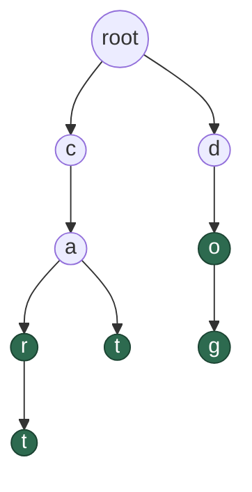

# Trie

References: [`GLOSSARY.md`](../../../../GLOSSARY.md) ·
[`ROADMAP.md`](../../../../ROADMAP.md) ·
[Binary Tree notes](BINARY_TREE_NOTES.md) ·
[Hash Set notes](../hashing/HASH_SET_NOTES.md)

## What it is

A trie (say "try", from re**trie**val) stores a set of **strings** in a
way that makes prefixes first-class. Every edge is a **character**, and a
word is a path from the root down.

The name for it is a **prefix tree**, and that's the whole idea: words
sharing a prefix share the nodes for that prefix. Storing `car`, `cart`,
`cat`, `do`, `dog`:



Green nodes end a word. Read a word by walking from the root down to
one: `c-a-r` spells `car`, `c-a-r-t` spells `cart`, `c-a-t` spells
`cat`. The root holds no character — it's the starting point every word
is spelled from.

Those five words are 15 characters in total, but the trie uses **8
nodes** below the root. `car`, `cart`, and `cat` all share `c-a`, and
that shared part exists exactly once.

Two structural points that differ from every tree so far:

- **A node holds no value of its own.** Its identity comes from the
  path taken to reach it. The character lives on the edge, not in the
  node — so in code, a node holds a **map from character to child**.
- **Branching isn't binary.** A node has as many children as there are
  distinct next characters. For lowercase English that's up to 26.

## Why the end-of-word flag is not optional

Look at `do` and `dog` above. `do` is a complete word *and* a prefix of
another word. Without something marking where words end, the trie can't
tell those apart — every path down would look equally valid, and
`contains("d")` would wrongly say `true`.

So each node carries a boolean: **"does a word end here?"** In the
diagram those are the green nodes. `o` is green (the word `do`), `g` is
green (`dog`), but `c`, `a`, and `d` are not — they're only ever passed
through.

This is the single most common place to go wrong with a trie, and the
tell is that `contains` starts returning `true` for prefixes.

## The two questions a trie answers differently

```
contains("ca")    ->  false      the path exists, but no word ends there
startsWith("ca")  ->  true       the path exists, which is all this asks
```

That pair is the entire reason to choose a trie. A hash set can answer
the first question; it cannot answer the second without examining every
key it holds.

The mechanism is identical for both — walk the path character by
character. They differ only in what happens once you arrive:

- **`contains`** — did the path exist, *and* is the final node marked as
  a word end?
- **`startsWith`** — did the path exist? Nothing else matters.

And once you can find the node a prefix ends at, "give me every word
with this prefix" is just collecting the word-ends in that node's
subtree.

## Complexity

Let **m** be the length of the string being looked up, and **n** the
number of words stored.

| operation | time |
| --- | --- |
| `insert` | O(m) |
| `contains` | O(m) |
| `startsWith` | O(m) |
| `wordsWithPrefix` | O(m + k), k = characters in the matches |

The striking part: **`n` does not appear.** Looking up a 5-letter word
costs the same whether the trie holds ten words or ten million, because
you only ever walk the path for the word in hand. Compare a list of
strings, where finding one is O(n · m).

Worth being precise about the hash set comparison, since "O(1) beats
O(m)" is the wrong reading. Hashing a string of length `m` must look at
all `m` characters, so `HashSet.contains` is really O(m) too. The two
are comparable for exact lookup. **The trie's advantage isn't speed on
that operation — it's the operations a hash set cannot perform at all.**

## Space cost

This is the trade. A trie can use considerably *more* memory than
storing the strings plainly, because every node carries a map, and a map
with one entry still costs far more than one character.

The saving from shared prefixes only pays off when prefixes are actually
shared. A trie of random unrelated strings is close to worst case: one
chain per word, plus map overhead on every node. A trie of English
words, where thousands share prefixes like `pre` and `un`, is where it
earns its keep.

There are compressed variants — a **radix tree** collapses each chain of
single-child nodes into one node holding a whole substring — which is
how this gets used in memory-sensitive places like IP routing tables.
Not implemented here, but worth knowing the word.

## The invariant

**A node's meaning is the path taken to reach it**, not anything stored
in it. Break that — insert a character into the wrong child slot — and
the word is silently unreachable, because lookup will follow the correct
path and find nothing.

Alongside it: **a word exists in the trie if and only if its final node
is flagged.** A path existing is *not* the same as a word existing, and
conflating the two is what makes `contains` accept prefixes.

The empty string is the edge case that tests both: it's the path of zero
characters, which lands on the root. Whether `""` counts as a stored word
is then just "is the root flagged?" — consistent, once you accept the
root as a legitimate destination.

## When to reach for it

Whenever the question involves **prefixes** rather than whole values:

- **Autocomplete and type-ahead** — the canonical use. Every keystroke
  extends the prefix by one character, which is one more step down.
- **Spell checking** — is this a word, and what near-misses share its
  prefix.
- **IP routing** — longest-prefix matching over address bits, using the
  compressed radix variant.
- **Word games** — Boggle and Scrabble solvers prune whole branches the
  instant a path stops being a valid prefix, which is exactly
  `startsWith` returning false.

That last one generalises: a trie makes **failing fast** cheap. In a
backtracking search (Phase 7), being able to abandon a branch as soon as
the prefix is invalid removes enormous amounts of work.

Reach for a **hash set** instead when you only ever ask "is this exact
string present." It's simpler and lighter. The trie is worth its cost
only if you need prefixes.

## Check Your Understanding

1. Where is the character stored in a trie — in the node or on the edge?
   What does a node actually hold as a result?
2. Why does a node need an "end of word" flag? Give a concrete pair of
   words where the trie is wrong without it.
3. What is the difference between `contains("ca")` and
   `startsWith("ca")`, and which part of the lookup differs?
4. Trie operations are O(m) where m is the word's length. Why does the
   number of stored words not appear in that complexity?
5. `HashSet.contains` is described as O(1) average and a trie's as O(m).
   Why is that comparison misleading, and what *is* the trie's real
   advantage?
6. When does a trie use more memory than just storing the strings in a
   list? When does prefix sharing actually pay off?
7. How would you collect every word starting with a given prefix? Which
   two operations does it decompose into?
8. What does the empty string correspond to in a trie, and how would you
   decide whether it's stored?
9. Why is a trie useful for pruning in a backtracking word search, where
   a hash set of valid words would not be?
