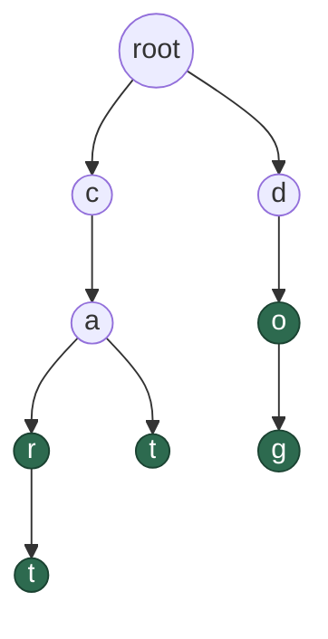

# Task: Trie

Build a trie from scratch — from [`TRIE_NOTES.md`](TRIE_NOTES.md). Keys
are `Strings` made of any characters; nothing assumes lowercase ASCII.

Create `src/main/kotlin/trees/Trie.kt` yourself (copy the stub below in,
then implement each function).

## What's different from the trees so far

- **The node holds no value.** Its meaning is the path taken to reach
  it, so it holds a **map from character to child** plus a flag.
- **Branching isn't binary.** A node has one child per distinct next
  character, so `MutableMap<Char, Node>` replaces `left`/`right`.
- **Nothing recurses on a comparison.** Every operation walks the string
  character by character. Insert, contains, and startsWith are all the
  same walk — they differ only in what they do when a character is
  missing, and what they check on arrival.

## The trie used in the examples

Inserting `car`, `cart`, `cat`, `do`, `dog`:



Green nodes end a word. Eight nodes below the root, for five words
totalling fifteen characters.

## Operations

**`insert(word: String)`**
Adds `word`. Walks the string, creating any node that doesn't exist yet,
and flags the final node as a word end. Inserting the same word twice is
a no-op the second time — no new nodes, and `size()` unchanged.

*Framing: this is the only operation that creates nodes. Every other one
gives up when a character is missing; this one fills the gap instead.
`MutableMap` has a method that returns the existing value for a key or
computes and stores one — worth finding, since it collapses the
"does this child exist?" branch into a single call.*

**`contains(word: String): Boolean`**
Whether `word` was inserted. `contains("ca")` is `false` even though
that path exists — nothing ends there.

**`startsWith(prefix: String): Boolean`**
Whether `prefix` is a valid path in the trie — that is, whether walking
it character by character stays on existing nodes. `startsWith("ca")` is
`true`.

Note the wording: *is this a valid path*, not *does some word start with
this*. The two only diverge on one input — an empty trie asked for the
empty prefix — where this definition says `true`, because a zero-length
walk trivially succeeds and lands on the root. That's the simpler rule
and the one this task uses.

*Framing: `contains` and `startsWith` do the identical walk and differ
only in the last step. Write the walk once as a private helper returning
the node the path ends at (or null), and both become one line each.*

**`wordsWithPrefix(prefix: String): List<String>`**
Every stored word beginning with `prefix`, in ascending order. An
absent prefix returns an empty list; an empty prefix returns every word.

*Framing: two steps that you've already got. Walk to the prefix's node,
then collect every word end beneath it. The collecting part needs to
rebuild each word as it descends — what does it carry down alongside the
node?*

**`words(): List<String>`**
Every stored word, in ascending order.

*Framing: this is `wordsWithPrefix` with a particular argument.*

**`size(): Int`**
How many distinct words are stored. Not the node count.

**`isEmpty(): Boolean`**
Whether any word is stored.

## Expected values for the example trie

| call | result |
| --- | --- |
| `words()` | `[car, cart, cat, do, dog]` |
| `size()` | `5` |
| `contains("cat")` / `contains("ca")` | `true` / `false` |
| `startsWith("ca")` / `startsWith("zebra")` | `true` / `false` |
| `wordsWithPrefix("ca")` | `[car, cart, cat]` |
| `wordsWithPrefix("do")` | `[do, dog]` |
| `wordsWithPrefix("z")` | `[]` |
| `wordsWithPrefix("")` | `[car, cart, cat, do, dog]` |

## Edge cases to handle

- **Empty trie** — `contains` is `false` for everything including `""`;
  `startsWith` is `false` for everything *except* `""`, which is `true`
  (see its definition above); `words()` is empty, `size()` is `0`,
  `isEmpty()` is `true`. Nothing throws.
- **A word that is a prefix of another** — `do` and `dog`. Both must be
  found by `contains`, and `contains("d")` must be `false`. This is the
  case the end-of-word flag exists for; an implementation without it
  passes everything else.
- **Inserting a duplicate** — no new nodes, `size()` unchanged.
- **A prefix longer than anything stored** — `contains("doge")` and
  `startsWith("doge")` are both `false`. The walk runs out of nodes
  partway.
- **The empty string.** `startsWith("")` is `true` for any trie,
  including an empty one. `contains("")` is `false` until `""` is
  actually inserted — inserting it flags the root, after which
  `contains("")` is `true` and `size()` is `1`, with no nodes created.
- **`wordsWithPrefix` where the prefix is itself a word** — `do` should
  appear in its own results.
- **Ordering.** Results come back ascending, which falls out of visiting
  each node's children in sorted key order rather than needing a sort at
  the end.

## Stub

```kotlin
package trees

class Trie {
    private class Node {
        val children = mutableMapOf<Char, Node>()
        var isWord = false
    }

    private val root = Node()
    private var size = 0

    fun insert(word: String) {
        TODO()
    }

    fun contains(word: String): Boolean {
        TODO()
    }

    fun startsWith(prefix: String): Boolean {
        TODO()
    }

    fun wordsWithPrefix(prefix: String): List<String> {
        TODO()
    }

    fun words(): List<String> {
        TODO()
    }

    fun size(): Int {
        TODO()
    }

    fun isEmpty(): Boolean {
        TODO()
    }
}
```

Note `root` is a `val` and never null — unlike the BST, where an empty
tree meant `root == null`. A trie always has a root; an empty trie is
one whose root has no children and isn't flagged. That removes the
nullable-root handling entirely, and it's why `startsWith("")` naturally
returns `true`.
